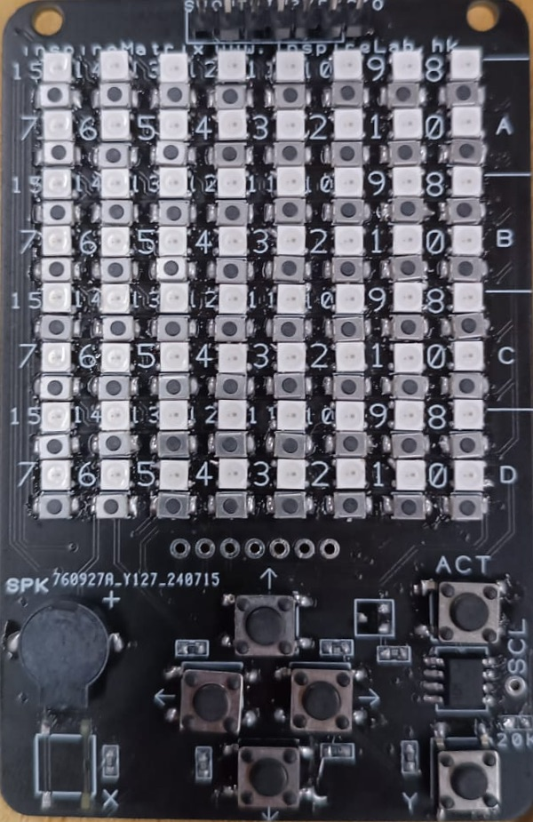

# InspireMatrix + CH32V003

This repository contains various projects and utilities for
working with the CH32V003 microcontroller.

Older hardware (InspireMatrix):



## Project Structure

* `.github`:
  * `workflows`: GitHub Actions workflows.
  * `Doxyfile`: Doxygen configuration.

* `.vscode`:
  * `settings.json`: VSCode settings:

    ```json
    "C_Cpp.default.compilerPath": "riscv-none-elf-gcc",
    ```

  To set the default compiler to `riscv-none-elf-gcc` for IDE integration.

* `ch32v003_stt`
  * Simple spoken digit recognition.
  * Originally from <https://github.com/brian-smith-github/ch32v003_stt>
  * Read its [README.md](ch32v003_stt/STT-README.md) for more information.

* `ch32v003fun`
  * `driver.h`: Contains the most frequently used functions for the CH32V003.
  * `i2c_events.h`: Contains some frequently used I2C functions written manually.
  * `i2c_tx.c`, `i2c_tx.h`, `oled_min.c`, `oled_min.h`: Contains some frequently used functions for the SSD1306 OLED display. Comes from <https://github.com/eric15342335/inspirelab-game>
  * `ws2812b_simple.h`: Contains one function for controlling the WS2812B LEDs.
  You need to declare the following variables in your code:
  In `funconfig.h`:
  
    ```c
    #define FUNCONF_SYSTICK_USE_HCLK 1
    ```

    In your code (e.g. `main.c`):
  
    ```c
    #define WS2812BSIMPLE_IMPLEMENTATION
    // ...
    #include "ws2812b_simple.h"
    ```

  * Originally from the `extralibs` folder in <https://github.com/cnlohr/ch32v003fun>

* `data`
  * `buttons.h`: Button ADC calibration data.

    Contains two sets of data, one for the first prototype
    `InspireMatrix` and one for the second prototype `InspireComputer` (which uses two ADC channels for buttons). If you are using the `InspireComputer`, declare the following in `funconfig.h`:

    ```c
    #define INTERNAL_INSPIRE_MATRIX
    ```

  * `colors.h`: Contains the color palette for the `InspireMatrix` or `InspireComputer`.
  
    One global variable `led_array[]` act as buffer to store the color data to be displayed.
    Provides functions to manipulate the `led_array[]` buffer.

  * `fonts.h`: Display numbers and characters in the size of 3x5 on WS2812B LEDs.

  * `music.h`: Frequencies, durations and functions for playing music using a buzzer.
  To play sound, use `JOY_sound()`.

* `emulator`
  * Support development of basic embedded system software on Windows/MacOS without requiring
  physical hardware.
  * Aims to achieve function compatibility with the `ch32v003fun` library.

* `i2c-comm`
  * Communication between two boards using I2C protocol. The code contains a master and a slave.

* `misc`
  * `libgcc.a` required by the `ch32v003fun` library on MacOS. See [here](misc/README.md) for more information.

* `movingnum`
  * Animations of numbers moving from right to left, bottom to top. Uses math instead of hard coding.
  Demonstrates the use of `fonts.h`.

* `paint-cursor`
  * Draw images on `InspireMatrix` with direction buttons and matrix buttons
  * Connection:
    * PD2: SW (Analog to Digital PIN)
    * PC6: IN (WS2812B Data PIN)

* `paint`
  * Paint on `InspireMatrix`.

* `rv-asm`
  * Coding RISC-V Compressed instructions on a board with buttons, and showing the result on the matrix.
  * Originally from <https://github.com/mnurzia/rv>

* `rv-dis` (Working in progress)
  * Disassemble RISC-V compressed instructions and print the result on an external OLED display (e.g. SSD1306).
  * Originally from <https://github.com/michaeljclark/riscv-disassembler>

* `testing`
  * This folder contains a bunch of test programs that are subject to change, and are not guaranteed to work for
  your specific hardware.

> [!NOTE]
> Both `savepaint` and `save-rvasm` implements an filesystem structure.

* `savepaint`
  * Add saving and loading features.
  * Combines `paint`, `movingcar`, `snake-game` and `tic-tac-toe`
  * How to play:
    * Before first icon appearing, hold Y to clear all the saved paints.
    * After first icon appearing, use `UP` and `DOWN` to select apps.
    * Use `LEFT` to use the selected app.
    * Integrated `paint`:
      * Press 64 (or `NUM_LEDS` buttons) to toggle between foreground color and background color.
      * Press X or Y to change the foreground or background color.
      * Press `UP` button to load a saved paint.
      * Press `DOWN` button to save the current paint.
    * Integrated `movingcar`:
      * Currently 64 buttons are divided into left and right section.
      * For each row (8 buttons), left four buttons correspond to `Left Wheel Forward`, `Left Wheel Backward`, `Right Wheel Forward`, `Right Wheel Backward`.
      * For each row (8 buttons), right four buttons correspond to `Red`, `Green`, `Blue` and `Special Command` (Currently not used). The LEDs will display the colors when the motor is running.
      * E.g. if buttons (counting from left) 1, 3, 5 are pressed, the car will go forward and displays red on the entire screen.
      * Special: If all 8 buttons are pressed, the program will go back the first instruction to execute.
    * Integrated `snake-game`:
      * Press Y to start.
      * Use `up / down / left / right` to move the snake.
    * Integrated `tic-tac-toe`:
      * Press any of the empty spot to play.
    * When any of the app ends, press `Y` to go back to the main menu. (`NVIC_SystemReset()` is called)

* `save-rvasm`
  * Add saving and loading features
  * Uses `rv-asm`.
  * How to play:
    * Before the load save menu appear, hold `X` to clear all the saved paints.
    * Pick a saved program to load. Each program size is 32 instructions (hence 64 bytes / 1 page in the filesystem).
    * Press `Y` to load the default program (Smile face) instead of loading a saved program.
      You must choose this if no program are saved.
    * Use `UP` and `DOWN` to navigate the instruction pages. The top 32 LEDs in light pink indicates
      which page is currently displayed. E.g. 1 LED on => page 1 => Instruction 1 and 2.
    * Use `Y` to execute the program.
    * The button `32` LEDs are used to display the current instruction, with the active bit highlighted as `blue`.
    * Notes when writing programs:
      * You `MUST` end your program with an `ecall` (a.k.a `0x0073`) to exit the program.

* `snake-game`
  * Porting the classic snake game to `InspireMatrix`, which has `8x8`=`64` LEDs and `up / down / left / right` controls.

* `tic-tac-toe`
  * Play tic-tac-toe with a bot
  * Press button to start
  * Green is player while Red is the bot
  * Try to win it (very easy)

## `funconfig.h` Explanation

```c
#ifndef _FUNCONFIG_H // Guard
#define _FUNCONFIG_H

#define CH32V003 1 // Required
#define FUNCONF_USE_DEBUGPRINTF 0
#define FUNCONF_USE_UARTPRINTF 1 // For printf() over UART (Use Hercules to view)
#define FUNCONF_UART_PRINTF_BAUD 115200 // Baud rate
// Connect UTX pin to RX pin in WCH-LinkE

// Newly created definitions
#define horizontalButtons 8
#define verticalButtons 8
#define NUM_LEDS (horizontalButtons * verticalButtons)

// Not required for the new InspireComputer board
// For GameConsole, need to define the following
// and connect buzzer pin to RX.
// Affects ch32v003fun.h SystemInit() UART printf initialization.
// #define CH32V003J4M6_USE_PD6_AS_UART_TX

// Required for WS2812B LEDs `ws2812b_simple.h`
#define FUNCONF_SYSTICK_USE_HCLK 1

#endif

```

## Compilation

Two options are available for compilation:

* `make`
  * Compile and output `*.hex` and `*.bin` files which can be used for flashing the program into
  CH32V003.

* `make emulator`
  * Compile an executable using `GCC` which runs natively on your operating system, simulating behaviour on real hardware.

## Credits

Great thanks to these projects (LICENSE included):

* <https://github.com/cnlohr/ch32v003fun>
* <https://github.com/brian-smith-github/ch32v003_stt>
* <https://github.com/mnurzia/rv>
* <https://github.com/michaeljclark/riscv-disassembler>
* <https://github.com/hexeguitar/ch32v003fun_libs>

## Check out our other projects as well

* <https://github.com/eric15342335/inspirelab-game>
  * A game console based on the `CH32V003J4M6` MCU.
  * Originally from <https://github.com/wagiminator/CH32V003-GameConsole>

* <https://github.com/eric15342335/BitNetMCU>
  * Receives image data via UART and predict the digit using an ML model.
  * Originally from <https://github.com/cpldcpu/BitNetMCU>
